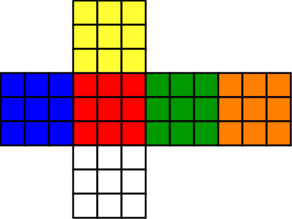

# Rubik's Cube Solver
<div>
        
</div>
<br>

This project, developed by Stefano Bonetto, serves as a submission for the "Signal, Image and Video" course at UniTN, part of the Artificial Intelligence Systems master's program.

The aim is to provide a straightforward solution to solving a Rubik's cube, leveraging a color detection method. This approach doesn't use any machine learning algorithms for the color detection, instead relying solely on image processing techniques to analyze the values of each processed pixel.

<p align="center">
  
</p>

This project is divided into two primary components. The first involves recognizing the cube and detecting the position and colors of each cell to determine the cube's current state.

A key assumption is that the solver directs the user to follow a specific sequence for accurately scanning the cube. This premise forms the basis from which I developed my solution.

The scan of the cube follow this order:

<ul>
  <li>face with the yellow central cell</li>
  <li>face with the blue central cell</li>
  <li>face with the red central cell</li>
  <li>face with the green central cell</li>
  <li>face with the orange central cell</li>
  <li>face with the white central cell</li>
</ul>

<p align="center">
  
</p>

We obviously need to pay attention to the orientation of the face.

<br>

The cube-solving component of the project utilizes the [kociemba](https://github.com/muodov/kociemba) algorithm. 

This algorithm generates a sequence of moves, adhering to [this notation](https://ruwix.com/the-rubiks-cube/notation/). To make these moves more user-friendly, I've integrated corresponding arrows into the webcam feed for each move, providing intuitive guidance for the user on how to proceed.


## Project Layout
```
└──faces	                # ROIs
├──pngs	                        # stuff for GUI  
├──rubik_venv
├──scan                         # original images from webcam
├──squares                      # each square of each face 
|      ├──1
|      |  ├──square_1.png
|      |  ├──square_2.png
|      |  ├──---.png
|      |  └──square_9.png
|      ├──2
|      ├──3
|      ├──4
|      ├──5
|      └──6
├──README.md
├──REPORT_Rubik_Cube.pdf
├──clear.py                    # this script helps me to clear all folders
├──main.py
└──requirements.txt
```

## Requirements
To deploy this project is required a python environment (> 3.6). Is also suggested to build a virtual environment:
```
python3 -m venv rubik_venv
```
to activate it:
```
source rubik_venv/bin/activate
```
and install all the requirements for this project:
```
pip3 install -r requirements.txt
```

## Run

To launch the application, simply enter the following command:
```
python3 main.py
```

## Contact me
Stefano Bonetto: stefano.bonetto@studenti.unitn.it <br>
                 

