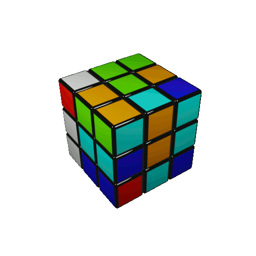

<!---->
<!---->
<!---->
<!---->
<!---->
<!---->


# Rubik's Cube Solver
This project has been developed by Stefano Bonetto as the exam for the UniTN course of "Signal, Image and Video" course of the Artificial Intelligence Systems master.

<p align="center">
  
</p>

The project is composed by two main parts, the first part is the recognition of the cube and the detection of the position and the colors of the cell to know the state of the cube. <br>

Then we have the algorithm to solve the cube, which is mainly composed by recursive functions. 

## Requirements
To deploy this project is suggested to build a virtual environment:
```
$ python3 -m venv my_venv
```
to activate it:
```
$ source my_venv/bin/activate
```

To install all the requirements for this project, just type:
```
$ pip3 install -r requirements.txt
```

## Contact me
Stefano Bonetto: stefano.bonetto@studenti.unitn.it <br>
                 

